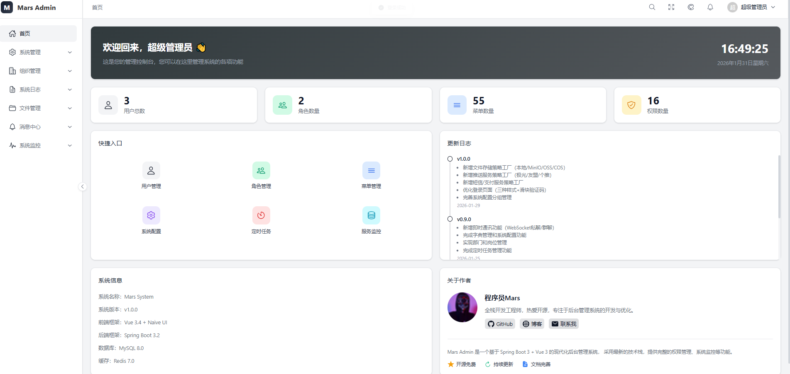
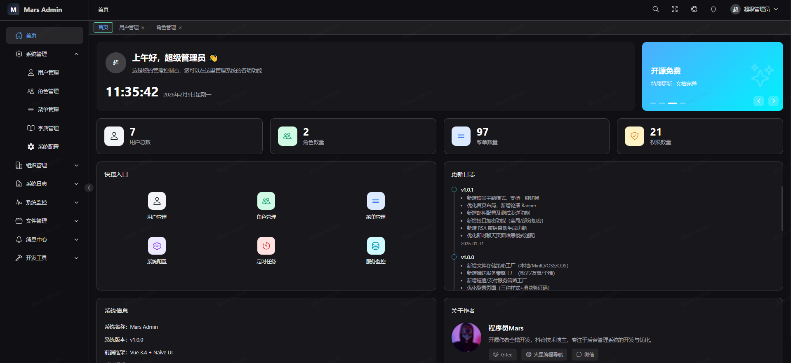
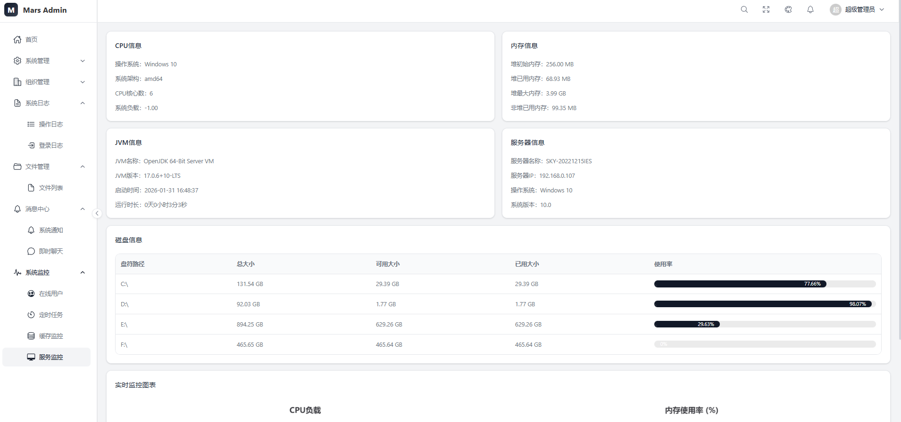

<div align="center">

# Jiejie Admin

**基于 Spring Boot 3 + Vue 3 的企业级通用后台管理系统**

全栈 · 多模块 · 云原生部署 · PC 与移动端自适应

<p>
  <a href="https://jiejie-admin.onrender.com"></a>
  <a href="https://github.com/Konglong7/jiejie-admin"></a>
</p>


[在线演示](https://jiejie-admin.onrender.com) · [功能特性](#-功能特性) · [技术栈](#-技术栈) · [快速开始](#-本地快速开始) · [部署手册](DEPLOY.md)

</div>

---

## 🌐 在线演示

> **演示地址：<https://jiejie-admin.onrender.com>**

| 角色 | 账号 | 密码 | 权限范围 |
| :--- | :--- | :--- | :--- |
| 超级管理员 | `admin` | `123456` | 全部模块与配置权限 |
| 技术总监 | `zhangsan` | `123456` | 研发部门视角，含监控、代码生成、接口管理 |
| 产品总监 | `lisi` | `123456` | 产品部门视角，含流程审批与业务管理 |

登录页提供 **「演示账号 → 一键填入」**，点击即自动填好账号密码并跳过验证码，无需手动输入。

> [!NOTE]
> **首次打开可能需要 30~60 秒**。演示站部署在 Render 免费实例上，长时间无人访问会自动休眠；页面会显示唤醒进度提示，请稍候，唤醒后再次访问即为秒开。
> 演示环境已开启「演示模式」，后端切面对新增/修改/删除等写操作统一拦截并返回友好提示，**数据可放心点击，不会被破坏**。

<div align="center">


**手机扫码直接体验**
</div>

---

## 📸 界面预览

<table>
  <tr>
    <td width="50%" align="center"><b>登录页 · 演示账号一键填入</b><br/></td>
    <td width="50%" align="center"><b>数据看板首页</b><br/></td>
  </tr>
  <tr>
    <td width="50%" align="center"><b>暗色主题</b><br/></td>
    <td width="50%" align="center"><b>用户管理 · RBAC 权限分配</b><br/></td>
  </tr>
  <tr>
    <td width="50%" align="center"><b>服务器监控 · CPU / 内存 / JVM</b><br/></td>
    <td width="50%" align="center"><b>即时通讯 · WebSocket 私聊群聊</b><br/></td>
  </tr>
  <tr>
    <td width="50%" align="center"><b>系统通知 · 已读未读状态</b><br/></td>
    <td width="50%" align="center"><b>文件管理 · 本地 / MinIO / OSS 多策略</b><br/></td>
  </tr>
  <tr>
    <td colspan="2" align="center"><b>系统配置 · 参数动态维护</b><br/></td>
  </tr>
</table>

---

## ✨ 功能特性

### 系统管理
- **用户管理** — 增删改查、角色分配、状态管理、用户黑名单
- **角色管理** — 权限配置、菜单分配、数据权限
- **菜单管理** — 菜单增删改查、权限标识配置
- **部门管理** — 组织架构树形结构
- **岗位管理** — 岗位增删改查
- **字典管理** — 数据字典与字典项维护
- **系统配置** — 系统参数动态配置（分组管理）

### 系统监控
- **在线用户** — 当前在线用户查看、强制下线
- **定时任务** — Quartz 任务调度与执行日志
- **服务监控** — 服务器 CPU、内存、JVM 信息
- **缓存监控** — Redis 缓存信息与键值管理

### 日志管理
- **登录日志** — 登录记录、登录地点
- **操作日志** — AOP 切面自动记录用户操作

### 消息中心
- **系统公告** — 公告发布、已读未读状态
- **即时通讯** — WebSocket 实时消息、私聊、群聊与成员管理

### 文件管理
- **文件上传** — 支持本地 / MinIO / 阿里云 OSS
- **文件管理** — 列表、预览、下载、删除

### 代码生成
- **代码生成器** — 基于 Velocity 模板，按数据库表一键生成 Controller / Service / Mapper / Entity 与 Vue3 + Naive UI 前端视图

### 安全特性
- **验证码** — 图片 / 滑块 / 短信验证码
- **接口加密** — RSA 非对称加密传输
- **登录安全** — 登录失败限制、账号锁定
- **权限控制** — 基于 RBAC 的细粒度权限
- **多种登录方式** — 密码 / 短信 / 社交 / 小程序

### 扩展服务（策略工厂模式）
| 能力 | 可插拔实现 |
| :--- | :--- |
| 文件存储 | 本地 / MinIO / 阿里云 OSS |
| 短信服务 | 控制台 / 阿里云 / 腾讯云 |
| 支付服务 | 微信支付 / 支付宝 |
| 推送服务 | 控制台 / 极光 / 友盟 / 个推 |
| 社交登录 | 微信公众号 / 微信小程序 / 支付宝 / 苹果 |

---

## 🧱 技术栈

### 后端

| 技术 | 版本 | 说明 |
|------|------|------|
| Spring Boot | 3.2.2 | 基础框架 |
| MyBatis-Plus | 3.5.5 | ORM 框架 |
| Sa-Token | 1.37.0 | 权限认证框架 |
| Redis | 7.0+ | 缓存 / 会话存储 |
| MySQL | 8.0+ | 数据库 |
| Quartz | 2.3.2 | 定时任务框架 |
| Hutool | 5.8.25 | Java 工具类库 |
| Warm-Flow | — | 工作流引擎 |
| MinIO / 阿里云 OSS | — | 对象存储（可选） |

### 前端（PC 管理后台）

| 技术 | 版本 | 说明 |
|------|------|------|
| Vue | 3.4.15 | 前端框架 |
| Vite | 5.0.11 | 构建工具 |
| TypeScript | 5.3.3 | 类型安全 |
| Naive UI | 2.37.3 | UI 组件库 |
| Pinia | 2.1.7 | 状态管理 |
| Vue Router | 4.2.5 | 路由管理 |
| Axios | 1.6.5 | HTTP 客户端 |
| ECharts | 6.0.0 | 图表库 |
| xterm.js | 6.0.0 | 终端模拟器 |

### 移动端（小程序）

| 技术 | 版本 | 说明 |
|------|------|------|
| UniApp | — | 跨平台框架 |
| uView Plus | 3.3.36 | UI 组件库 |
| crypto-js | 4.2.0 | 加密工具 |

### 部署与运维

| 能力 | 实现 |
| :--- | :--- |
| 容器化 | 三阶段 Dockerfile（Node 构建前端 → Maven 打包后端 → JRE Alpine 运行） |
| 计算 | Render Web Service（免费层，512MB RAM，已做 JVM 堆与 GC 约束） |
| 数据库 | TiDB Cloud Serverless（MySQL 8.0 协议兼容） |
| 缓存 | Upstash Serverless Redis（TLS） |
| 保活 | GitHub Actions + Cron-Job.org 双心跳，规避免费实例休眠 |
| PWA | Service Worker 静态资源缓存 + Web App Manifest，移动端可添加到主屏幕 |

---

## 📂 项目结构

```
jiejie-admin
├── jiejie-common              # 公共基础模块（entity / exception / result / util）
├── jiejie-infra               # 基础设施层
│   ├── jiejie-db              # 数据库配置
│   ├── jiejie-redis           # Redis 配置
│   ├── jiejie-oss             # 文件存储（本地 / MinIO / 阿里云 OSS）
│   ├── jiejie-sms             # 短信服务（阿里云 / 腾讯云）
│   ├── jiejie-pay             # 支付服务（微信 / 支付宝）
│   ├── jiejie-push            # 推送服务（极光 / 友盟 / 个推）
│   ├── jiejie-social          # 社交登录
│   ├── jiejie-wechat          # 微信公众号 / 小程序
│   ├── jiejie-websocket       # WebSocket 支持
│   ├── jiejie-crypto          # 加密解密
│   └── jiejie-mail            # 邮件发送服务
├── jiejie-core                # 业务核心层
│   ├── jiejie-system          # 系统管理（用户 / 角色 / 菜单 / 部门 / 字典 / 配置）
│   ├── jiejie-auth            # 认证授权（密码 / 短信 / 社交 / 小程序登录策略）
│   ├── jiejie-file            # 文件管理
│   ├── jiejie-gen             # 代码生成
│   ├── jiejie-message         # 消息中心（公告 / 聊天 / 群聊）
│   ├── jiejie-workflow        # Warm-Flow 工作流业务适配
│   └── jiejie-biz             # 业务扩展模块
├── jiejie-api                 # 接口层
│   ├── jiejie-admin-api       # 后台管理接口
│   ├── jiejie-app-api         # APP / 小程序接口
│   └── jiejie-web-api         # 网页端接口
├── jiejie-job                 # 定时任务模块
├── jiejie-starter             # 启动入口
├── jiejie-ui                  # 后台管理前端（Vue 3 + Vite + Naive UI）
├── jiejie-uniapp              # 移动端小程序（UniApp）
├── sql                        # 数据库脚本（建表 + 演示数据）
├── doc                        # 界面截图与展示素材
├── Dockerfile                 # 多阶段构建
└── DEPLOY.md                  # 零成本云原生部署手册
```

---

## 🚀 本地快速开始

### 环境准备

- JDK 17+ / Maven 3.8+
- Node.js 18+
- MySQL 8.0+ / Redis 7.0+

### 1. 初始化数据库

```sql
CREATE DATABASE `jiejie-system` DEFAULT CHARACTER SET utf8mb4;
```

```bash
mysql -u root -p jiejie-system < sql/jiejie-system.sql   # 表结构 + 基础权限菜单
mysql -u root -p jiejie-system < sql/demo-data.sql       # 演示数据（可选，便于查看效果）
```

### 2. 修改配置

编辑 `jiejie-starter/src/main/resources/application-prod.yml`（或按需新增 dev 配置）：

```yaml
spring:
  datasource:
    url: jdbc:mysql://localhost:3306/jiejie-system
    username: root
    password: your_password
  data:
    redis:
      host: localhost
      port: 6379
      password:
      database: 6
```

> 本地调试建议将 `jiejie.demo-mode` 设为 `false`，否则新增 / 修改 / 删除会被演示模式切面拦截。

### 3. 启动后端

```bash
mvn clean install
cd jiejie-starter
mvn spring-boot:run
```

后端默认运行在 `http://localhost:8080`。

### 4. 启动前端

```bash
cd jiejie-ui
npm install
npm run dev
```

前端默认运行在 `http://localhost:3000`，已配置 `/api`、`/ws` 等代理到 `8080`。

### 5. 移动端

使用 HBuilderX 打开 `jiejie-uniapp` 目录，运行到微信开发者工具即可。

---

## ☁️ 云原生部署

项目已冻结全部容器化与生产环境配置，可直接复用：**三阶段 Dockerfile + Render Web Service + TiDB Cloud + Upstash Redis + 双心跳保活**，整套方案 100% 免费。

完整步骤（含数据库准备、环境变量、保活配置、简历与面试答辩模板）见 **[DEPLOY.md](DEPLOY.md)**。

---

## 📄 相关文档

| 文档 | 内容 |
| :--- | :--- |
| [DEPLOY.md](DEPLOY.md) | 零成本云原生部署实战手册 + 简历描述模板 + 面试高频问答 |
| [PROJECT_WALKTHROUGH.md](PROJECT_WALKTHROUGH.md) | 项目全景讲解：架构设计、核心链路、模块职责 |
| [PROJECT_ARCHIVE.md](PROJECT_ARCHIVE.md) | 项目归档手册 |

---

## 📜 开源协议

本项目基于 [MIT License](LICENSE) 开源。
